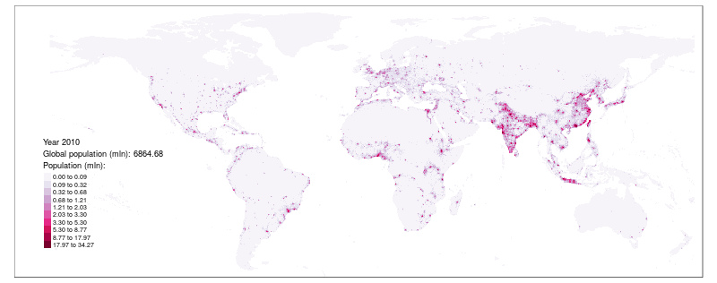

Global dataset of gridded population and GDP (1980-2010 estimations and 2020-2100 scenarios)
================

This dataset consists 0.5 × 0.5 degree grids of:

1.  Global population and GDP estimations for years 1980-2010 created by downscaling actual populations and GDPs by country
2.  Global population and GDP projections for years 2020-2100 created by downscaling projected populations and GDPs under three shared socioeconomic pathways (SSP): SSP1; SSP2; and SSP3 (source: [SSP database version 1](https://secure.iiasa.ac.at/web-apps/ene/SspDb/dsd?Action=htmlpage&page=about))

The dataset is modified [Global dataset of gridded population and GDP scenarios, version 3](http://www.cger.nies.go.jp/gcp/population-and-gdp.html). While the original dataset is a shapefile of 0.5 × 0.5 degree grids **masked by countries**, the new one contains a regular grid in form of a vector (.gpkg) and raster (.tif) files.

Data
----

The files below includes gridded populations (unit: millions) and GDPs (unit: PPP, Billion US$2005/yr) for years 1980-2100. Values from 1980-2010 were estimated by downscaling country-level data, while those in 2020-2100 are estimated by downscaling country-level data from SSP1, SSP2, and SSP3 scenarios. Names of the columns or files indicate the variables: `p_1980` to `p_2010` - estimations of populations; `g_1980` to `g_2010` - estimations of GDPs; `p1_2020`, `p2_2020`, `p3_2020` - projections of populations under SSP1, SSP2, and SSP3 scenarios, respectively; `g1_2020`, `g2_2020`, `g3_2020` - projections of GDPs under SSP1, SSP2, and SSP3 scenarios, respectively.

-   [Vector data]() - one .gpkg file containing all the data
-   [Raster data]() - 62 .tif files for each year, variable, and scenario

<!-- ## R package -->
Code
----

Downloading and reprocessing of the original data can be reproduced with the use of R scripts:

-   `R/01_data_download.R` - downloads the original data.
-   `R/02_regular_grid_recalculate.R` - joins the original vector and text files, and recalculates population and GDP values into a regular vector grid.
-   `R/03_rasterization.R` - rasterize the data from a regular vector grid into .tif files.

References
----------

-   Original data source: <http://www.cger.nies.go.jp/gcp/population-and-gdp.html>
-   Murakami, D. and Yamagata, Y. (2016) Estimation of gridded population and GDP scenarios with spatially explicit statistical downscaling, ArXiv, 1610.09041, URL: <https://arxiv.org/abs/1610.09041>.
